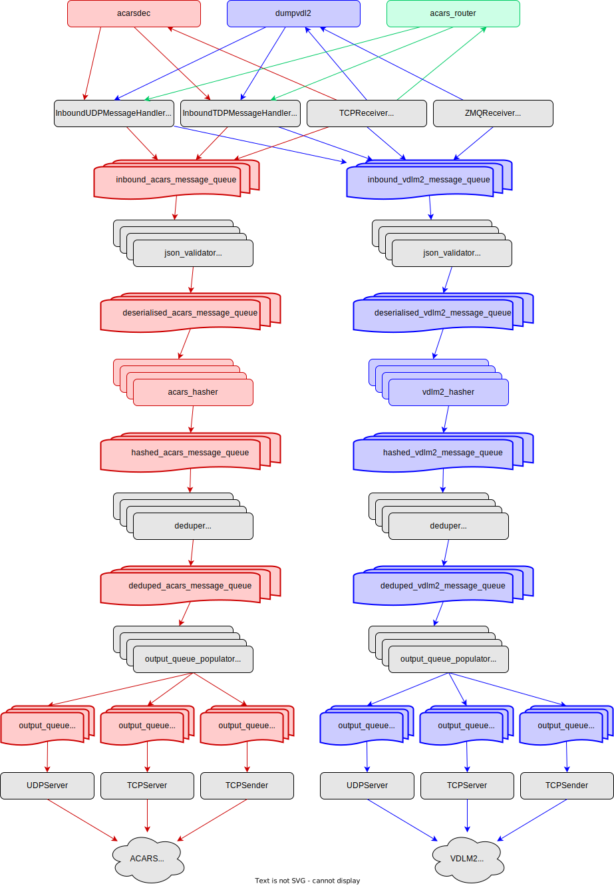

# ACARS Router

`acars_router` receives, validates, deduplicates, modifies and routes ACARS and VDLM2 JSON messages.

## Runtime Configuration

`acars_router` can be configured via command line arguments or environment variables. Command line arguments take preference over environment variables.

When using environment variables use `;` to separate entries, for example: `AR_SEND_UDP_ACARS="1.2.3.4:5550;5.6.7.8:5550"`

### Input

#### ACARS Input

| Argument | Environment Variable | Description | Default |
| -------- | -------------------- | ----------- | --------|
| `--listen-udp-acars` | `AR_LISTEN_UDP_ACARS` | UDP port to listen for ACARS JSON messages. Can be specified multiple times to listen on multiple ports. | |
| `--listen-tcp-acars` | `AR_LISTEN_TCP_ACARS` | TCP port to listen for ACARS JSON messages. Can be specified multiple times to listen on multiple ports. | |
| `--receive-tcp-acars` | `AR_RECV_TCP_ACARS` | Connect to "host:port" (over TCP) and receive ACARS JSON messages. Can be specified multiple times to receive from multiple sources. | |

#### VDLM2 Input

| Argument | Environment Variable | Description | Default |
| -------- | -------------------- | ----------- | --------|
| `--listen-udp-vdlm2` | `AR_LISTEN_UDP_VDLM2` | UDP port to listen for VDLM2 JSON messages. Can be specified multiple times to listen on multiple ports. | |
| `--listen-tcp-vdlm2` | `AR_LISTEN_TCP_VDLM2` | TCP port to listen for VDLM2 JSON messages. Can be specified multiple times to listen on multiple ports. | |
| `--receive-tcp-vdlm2` | `AR_RECV_TCP_VDLM2` | Connect to `host:port` (over TCP) and receive VDLM2 JSON messages. Can be specified multiple times to receive from multiple sources. | |
| `--receive-zmq-vdlm2` | `AR_RECV_ZMQ_VDLM2` | Connect to a ZeroMQ publisher at `host:port` (over TCP) and receive VDLM2 JSON messages as a subscriber. Can be specified multiple times to receive from multiple sources. | |

### Output

#### ACARS Output

| Argument | Environment Variable | Description | Default |
| -------- | -------------------- | ----------- | --------|
| `--send-udp-acars` | `AR_SEND_UDP_ACARS` | Send ACARS JSON messages via UDP datagram to `host:port`. Can be specified multiple times to send to multiple clients. | |
| `--send-tcp-acars` | `AR_SEND_TCP_ACARS` | Send ACARS JSON messages via TCP to `host:port`. Can be specified multiple times to send to multiple clients. | |
| `--serve-tcp-acars` | `AR_SERVE_TCP_ACARS` | Serve ACARS JSON messages on TCP `port`. Can be specified multiple times to serve on multiple ports. | |

#### VDLM2 Output

| Argument | Environment Variable | Description | Default |
| -------- | -------------------- | ----------- | --------|
| `--send-udp-vdlm2` | `AR_SEND_UDP_VDLM2` | Send VDLM2 JSON messages via UDP datagram to `host:port`. Can be specified multiple times to send to multiple clients. | |
| `--send-tcp-vdlm2` | `AR_SEND_TCP_VDLM2` | Send VDLM2 JSON messages via TCP to `host:port`. Can be specified multiple times to send to multiple clients. | |
| `--serve-tcp-vdlm2` | `AR_SERVE_TCP_VDLM2` | Serve VDLM2 JSON messages on TCP `port`. Can be specified multiple times to serve on multiple ports. | |

### Logging

| Argument | Environment Variable | Description | Default |
| -------- | -------------------- | ----------- | --------|
| `--stats-every` | `AR_STATS_EVERY` | Print statistics every `N` minutes | `5` |
| `-v` `--verbose` | `AR_VERBOSITY` | Increase log verbosity. `-v`/`AR_VERBOSITY=1` = Debug. `-vv`/`AR_VERBOSITY=2` = Trace (raw packets printed) | `0` (info) |

### Deduplication

| Argument | Environment Variable | Description | Default |
| -------- | -------------------- | ----------- | --------|
| `--enable-dedupe` | `AR_ENABLE_DEDUPE` | Enables message deduplication. | False |
| `--dedupe-window` | `AR_DEDUPE_WINDOW` | The window in seconds for duplicate messages to be dropped. | `2` |

### Message Modification

| Argument | Environment Variable | Description | Default |
| -------- | -------------------- | ----------- | --------|
| `--override-station-name` | `AR_OVERRIDE_STATION_NAME` | Overrides station id/name with this value | |

### Advanced Settings

You should not have to modify any of these for normal operation.

| Argument | Environment Variable | Description | Default |
| -------- | -------------------- | ----------- | --------|
| `--skew-window` | `AR_SKEW_WINDOW` | Reject messages with a timestamp greater than +/- this many seconds. | 1 |
| `--threads-json-deserialiser` | `AR_THREADS_JSON_DESERIALISER` | Number of threads for JSON deserialisers (per message protocol) | Number CPU cores |
| `--threads-hasher` | `AR_THREADS_HASHER` | Number of threads for message hashers (per message protocol) | Number CPU cores |
| `--threads-deduper` | `AR_THREADS_DEDUPER` | Number of threads for message dedupers | Number CPU cores |
| `--threads-output-queue-populator` | `AR_OUTPUT_QUEUE_POPULATOR` | Number of threads for output queue populators (per message protocol) | Number CPU cores |

## Internals

A high-level overview of the `acars_router` internals:

* Input
  * `acars_router` can receive data from ACARS/VDLM2 providers:
    * As a UDP server. `acarsdec`/`dumpvdlm2` can be configured to output UDP JSON by using the `--listen-udp-acars` and `--listen-udp-vdlm2` arguments respectively. This is the recommended way to receive data from `acarsdec`
    * As a TCP server for applications that output TCP JSON. The `--listen-tcp-acars` and `--listen-tcp-vdlm2` arguments can be used.
    * As a TCP client. `acars_router` can connect to a TCP server, and receive JSON. The arguments `--receive-tcp-acars` and `--receive-tcp-vdlm2` arguments can be used.
    * For `dumpvdl2`, `acars_router` supports ZeroMQ, and can connect to `dumpvdl2` and receive zmq JSON messages. This is the recommended way to receive data from `dumpvdl2`.
    * For each message received, a message object containing the raw JSON message (and some metadata) is then put into the `inbound_acars_message_queue` / `inbound_vdlm2_message_queue` for further processing.
* Validation
  * A pool of `json_validator` threads get messages from the inbound queues, and attempt to deserialise the JSON. The deserialised data is added to the message object, and the message object is then put into the `deserialised_acars_message_queue` / `deserialised_vdlm2_message_queue` for further processing.
* Hashing
  * The receive timestamp of the message object is reviewed. If the timestamp is outside +/- `--skew-window` seconds, the message is dropped.
  * A pool of `acars_hasher`/`vdlm2_hasher` threads then get messages from the deserialised queues, and hash the non-feeder-specific data in each message object.
  * The hash is added to the message object, and the message object is then put into the `hashed_acars_message_queue` / `hashed_vdlm2_message_queue` for further processing.
* Deduplicating
  * A pool of `deduper` threads then get messages from the hashed queues.
  * The hash in the message object is checked against a list of hashes of all messages received in the last *N* seconds.
  * If there is a match, the message is considered a duplicate, and is dropped.
  * If there is not a match, the message hash is added to the list of messages received in the last *N* seconds, and then the message object is placed into the `deduped_acars_message_queue` / `deduped_vdlm2_message_queue`.
  * An "evictor" process runs constantly, ensuring that message hashes in the recent message hash list do not exceed the `--dedupe-window` settings.
* Outbound Queue Population
  * When an output is configured with `--send-udp-acars`, `--send-tcp-acars`, `--send-udp-vdlm2` or `--send-tcp-vdlm2`, an output queue is created for each destination.
  * When an output is configured with `--serve-tcp-acars` or `--serve-tcp-vdlm2`, an output queue is created for each host that connects.
  * All of these output queues are kept in lists: `output_acars_queues` and `output_vdlm2_queues`.
  * A pool of `output_queue_populator` threads receive messages from the dedupe message queues. The message object is duplicated for each output queue in the output queue lists, and placed onto the queues. If `--override-station-name` has been set, the JSON is modified accordingly.
  * Each output queue is then processed by a TCP/UDP client/server and the processed JSON message is sent out.

I have attempted to show this in a flow diagram:

## Interpreting Logs

* With the default logging, the log level is informational and above. Log entries of levels `INFO`, `WARNING`, `ERROR` and `CRITICAL` are logged.
* With `-v`/`AR_VERBOSITY=1` the `DEBUG` level is added, and log entries include the originating thread.
  * Queue depths are logged in this level during scheduled statistics logging. During normal operation, all of these should be `0` (zero), with the exception of `recent_message_queue_acars` and `recent_message_queue_vdlm2`, which may be higher than zero - this is OK (as they contain a copy of message objects received in the past `--dedupe-window` / `AR_DEDUPE_WINDOW` seconds).
* With `-vv`/`AR_VERBOSITY=2` the `TRACE` level is added, which prints the contents of the message object as it traverses through each process. This level is very noisy and is intended for application troubleshooting.
  * As messages are received, they are given a UUID. This way, if odd message routing/processing behaviour is observed, the message object UUID can be found, the logs can be grepped for this UUID, and the logs will show how the message has been received and processed all the way through to being dropped or sent.

